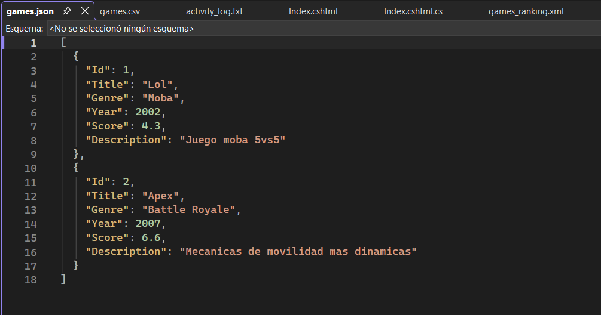
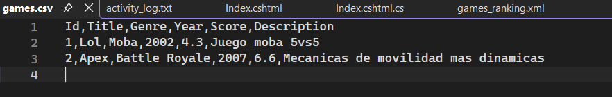
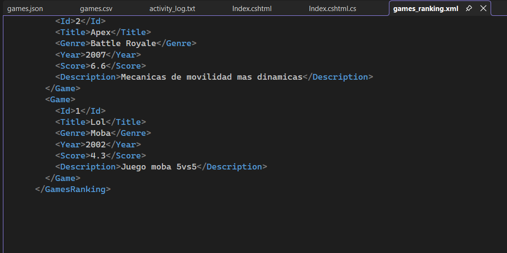
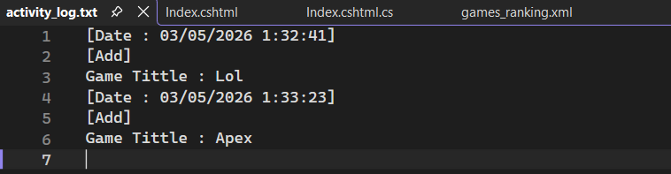

# Heroengine-FilesRazorQuestV2
Este proyecto consiste en una aplicación web desarrollada con ASP.NET Core Razor Pages diseñada para la gestión de  videojuegos.Usando persistencia de datos y la exportación de ficheros.

## Estructura del Proyecto

La arquitectura se ha diseñado de la siguiente forma:

*   **Directorio /Pages**: Aloja las vistas Razor y sus respectivos modelos de página (`.cshtml.cs`).
    *   Se ha organizado la navegación en subdirectorios específicos: Games para la gestion de paginas  y Files para las operaciones de descarga.
    *   Tuve un error a la hora de incializar la pagina por lo que tuve que crear un  Index.cshtml en la raíz de la carpeta Pages para gestionar la redirección inicial hacia Pages/Games, resolviendo problemas en la ruta de inicio por defecto de la aplicación.
*   **Directorio /Models**: Contiene la definición de la entidad Game.cs, que actúa como el modelo de datos central del sistema.
*   **Directorio /Service**: Implementa la lógica de negocio y la gestion de ficheros.
    *   **GameService**: Registrado como un servicio **Singleton**, este se encarga de centralizar las operaciones y es usado en las páginas Razor para garantizar un uso de dato unico para todos.
    *   **Clases de Soporte**: GameRepositor, GamesExporter y GamesRanking encapsulan la lógica específica para la gestión de archivos JSON, CSV, XML y TXT respectivamente.
*   **Directorio /wwwroot/Data**: +Sirve para el almacenamiento de los archivos de datos  generados por el la pagina.

## Ejemplos de Ficheros de Datos

El sistema utiliza los siguientes formatos para la lectura y escritura de información:

### JSON (`games.json`)
Guarda los juegos creados en un json.

### CSV (games.csv)
Guarda los juegos creados en un csv para la exportación de datos tabulares legibles por aplicaciones de hojas de cálculo.

### XML Ranking (games_ranking.xml)
Guarda los Juegos en orden de su puntuacion de mayor a menor

### Activity Log (activity_log.txt)
Guarda el historial de movimientos dentro de la pagina

